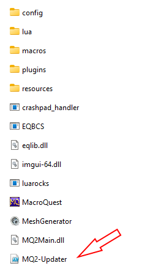

# MQ-Update
This script will update any current MQ installation (Even RedGuides and works with class plugins) or make a new clean install.
Make sure that MQ is NOT running before you run this updater script.
## How to
- Download the latest PowerShell file under [Releases](https://github.com/Zoh63392187/MQ-Updater/releases/)

- Place the downloaded file at the root of your MQ

- Run the MQ-Update.ps1 (Right click the file and select: Run with PowerShell)

The window should look like below

- Press "Update MQ"

The script will now download the source code

Once completed it should look like this:

Launch MQ and have fun- Game on!

## Everquest patchday and notes

Next time EverQuest patches and the MQ is outdated just run the script again and enjoy.
If MQ is not updated for the current version of EverQuest just wait another hour and try again

Please note that for the script to update your MQ installation the MQ Devs must have made a new release.
[Offcial MQ release](https://github.com/macroquest/macroquest/releases/) - All credit to the MQ devs and the hard work they do!
