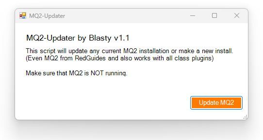

# MQ2-Updater
This script will update any current MQ2 installation (Even RedGuides and work with class plugins) or make a new clean install.
Make sure that MQ2 is NOT running before you run this updater script.
## How to
- Download the latest PowerShell file under [Releases](https://github.com/Zoh63392187/MQ2-Updater/releases/)

- Place the downloaded file at the root of your MQ2

- Run the MQ2Update.ps1 (Right click the file and select: Run with PowerShell)

The window should look like below

- Press "U" end hit enter

The script will now download the source code

Once completed it should look like this:

Launch MQ2 and have fun- Game on!

## Everquest patchday and notes

Next time EverQuest patches and the MQ2 is outdated just run the script again and enjoy.
If MQ2 is not updated for the current version of EverQuest just wait another hour and try again

Please note that for the script to update your MQ2 installation the MQ2 Devs must have made a new release.
[Offcial MQ2 release](https://github.com/macroquest/macroquest/releases/) - All credit to the MQ2 devs and the hard work they do!